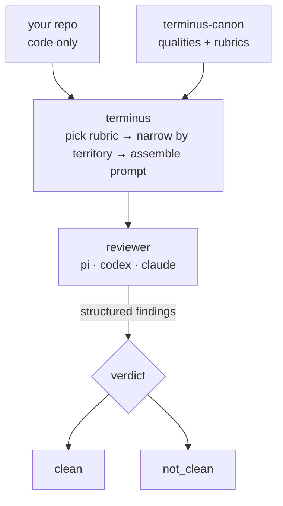

# Terminus

**A local MCP code-review broker.** Point it at a repo; it reviews the code against a central canon of quality definitions and tells you whether the code under review (or the workspace changes) are clean.

Terminus is the gate before code lands. It runs a fresh-context reviewer (your choice of `pi`, `codex`, or `claude`) against a finite review target, judges the work against criteria that live outside the project, and returns a structured verdict instead of free-form prose. No state, no rounds, no autofix — review, fix or reject, review again.

```text
$ terminus review --kind paths internal/auth
review 'a1b2c3d4e5f6' completed
project: myapp
rubric: rubric
verdict: not_clean
clean: false
reviewer: pi
findings: 1 blocking, 0 advisory
prompt: ~/.local/share/terminus/myapp/a1b2c3d4e5f6/_prompt.md
log:    ~/.local/share/terminus/myapp/a1b2c3d4e5f6/_findings.md

- [blocking] f1 (df-logging) internal/auth/session.go:42
  new code imports the standard library logger instead of df/dl
  suggestion: initialize and use dl for application logging
```

## How it works

The code under review and the criteria it's judged against live in two different places. The project repo supplies code only; the criteria — *qualities* — live in a separate **canon** repo you point Terminus at.



A review picks a **rubric** (which qualities apply), narrows it to the files in play by each quality's **territory**, hands the reviewer a self-contained prompt, validates the structured findings that come back, and computes a verdict. `clean` means the reviewer returned no *blocking* findings; advisories may still be present.

## Quickstart

Terminus is a Go program; build it with the toolchain or grab the binary from CI.

```bash
make build          # go install ./cmd/terminus
```

Write a `terminus.yaml` (see [`examples/`](examples/)). The only required field is `canon_path` — Terminus will not guess where your canon lives.

```yaml
canon_path: ../terminus-canon
log_destination: ~/.local/share/terminus   # default
reviewer:
  name: pi
  impl: pi        # pi | codex | claude
```

Run a review in the foreground:

```bash
terminus review                                  # your working-tree changes
terminus review --kind full                      # the whole tracked repo
terminus review --kind paths internal/ cmd/      # specific paths
terminus review --rubric architecture            # a different lens
```

Or run the MCP server and drive it from an agent:

```bash
terminus serve            # stdio MCP server; exposes start_review / collect_review
```

## Concepts

### Canon & qualities

A **quality** is a single markdown file: strict YAML frontmatter plus a self-contained body that *is* the rule. Nothing outside the canon governs the review.

```yaml
---
id: df-logging
applies_to:
  - go projects
territory:
  - "**/*.go"
---
```

Bodies follow a section template — `statement`, `why`, `discrimination`, `example`, `boundary` — and the reviewer is steered to each quality's `discrimination` and `boundary` as its flag/skip calibration. The general tier lives at the canon root (e.g. `go-conventions/df-logging.md`); project-local qualities and rubrics live under `projects/<project>/`.

### Rubrics

A **rubric** is the list of qualities a review applies, and whether each one blocks:

```yaml
project:
  repo: myapp
qualities:
  - ref: go-conventions/df-logging
    blocking: true
  - ref: go-conventions/truthful-naming
    blocking: false
```

A project can carry several **named rubrics** — different subsets of the canon for different lenses. They live flat at `projects/<project>/<name>.yaml`, default to `rubric.yaml`, and are selected with `--rubric <name>` (or the MCP `rubric` field). Blocking is per-rubric, so the same quality can block under `architecture` and merely advise under `code-issues`. List what a project has with `terminus rubrics`.

### Starting points, not a fence

The review target — working-tree changes, given paths, or the full tracked repo — is where the reviewer *begins*, not a boundary. It follows a change wherever it reaches (a caller, a dependent) and files findings where the problem actually lives, including files outside the target. The working-tree diff is the seed it traces from, not the limit of what it reviews.

## Interfaces

**CLI**

| Command | What it does |
| --- | --- |
| `terminus review [paths…]` | Run a review in the foreground and print the verdict + findings. |
| `terminus rubrics` | List the rubrics available for a project. |
| `terminus serve` | Run the stdio MCP server. |
| `terminus monitor <id> --wait` | Poll a running review's `status.json`. |
| `terminus version` | Print build metadata. |

`terminus review` flags: `--repo` (default `.`), `--kind` (`working-tree` | `paths` | `full`, default `working-tree`), `--rubric` (default `rubric`). A clean working tree with the default `--kind` is automatically promoted to `full` so a bare `terminus review` never reviews nothing.

**MCP**

- `start_review` — start a review in the background; takes `repo_path`, `changeset_kind`, optional `paths`, optional `rubric`. Returns a `review_id` and a monitor command.
- `collect_review` — collect a completed review by `review_id`, or list known runs when omitted. A still-running review returns a conflict.

## Where reviews are written

Review records live **outside** the subject repo, under `log_destination/<project>/<review_id>/` (default `~/.local/share/terminus`), because the prompt embeds private quality bodies. Each review directory holds:

- `status.json` — monitor/collection state
- `_prompt.md` — the exact prompt sent to the reviewer
- `_findings.md` — the immutable durable record
- `result.json` — the structured collection payload

## Status

This is the v1 review **spine**, deliberately minimal: no sessions, no rounds, no disposition capture, no survey, no canon promotion, no autofix loop. Iteration is external — fix or reject what a review surfaces, then start a new one. Forward-looking work is tracked in [`docs/future/`](docs/future/).

## Building & development

```bash
make build    # go install ./cmd/terminus
make test     # go test ./... && go vet ./...
```

Go conventions: `github.com/michaelquigley/df/dl` for logging and `github.com/michaelquigley/df/dd` for YAML/JSON binding.

## Orientation

Current behavior is documented in [`docs/current/`](docs/current/); the working conventions and agent-orientation guidance are in [`AGENTS.md`](AGENTS.md).
