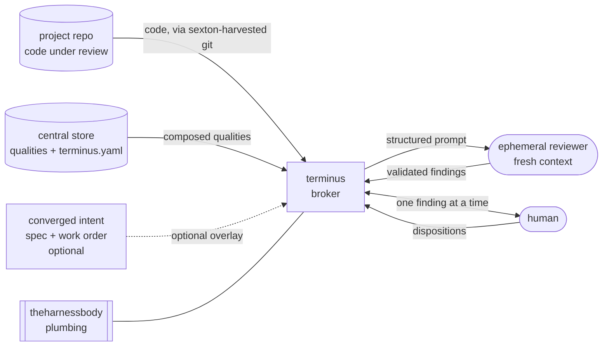

# Terminus — Vision

## what terminus is

Terminus is a code review broker. It sits between a human and an ephemeral reviewing agent during the review of a changeset, and returns a structured, triage-shaped verdict on whether that changeset is clean. It runs as a local MCP server, human-directed: a person points it at code, walks the findings one at a time, and decides what each one means.

It is the sibling of [mercurius](../../../mercurius). Mercurius reviews *intent* — a spec and work order, before anything is built — and converges on `ready_to_build`. Terminus reviews *realized code*, and converges on `clean`. Mercurius guards the boundary going in; terminus guards the boundary going out. The name is the load-bearing image: Terminus was the Roman god of boundary stones, the one marker that refused to be moved when the temple was built around him. A review asks whether a changeset can cross the boundary the stone marks — not whether the territory beyond it is finished.

Terminus reviews a changeset against two things. The first, always present, is a composed body of architectural guidance — the *qualities* the project is held to. The second, present only sometimes, is the converged intent that produced the code: when terminus is closing the loop mercurius opened, it has the spec and work order in hand and can ask whether the code did what the intent said and what it did that the intent never anticipated. When terminus is invoked proactively — on a changeset that never went through the pipeline, or on an old module someone just wants to look at — there is no intent overlay, only the changeset against the qualities. Same broker, same spine; intent is context present in one mode and absent in the other.

It is built on `theharnessbody` from the first commit, and it owns far less than it appears to.

## the problem, and the ghost

The previous iteration of this design was a tool called [otis](../../../../grimoire/software/otis/otis-vision.md). Otis was conceived as a continuous code-quality *agent* — a heartbeat watching a whole codebase against a body of knowledge, surfacing drift, never terminating, because a living codebase has no `ready_to_merge`. It never got airborne. Three things sank it: the machinery for doing reviews and building the body of knowledge was underdeveloped; the components were designed from scratch (calling the reviewer, git integration, a chat surface); and the ceremony around making the whole thing *continuous* collapsed the project before it ran once.

Terminus is the deliberate, narrowed second attempt. It takes the two ideas worth saving from otis — code-quality review, and the curated body of knowledge that defines what "good" means here — and puts them into a much simpler shape: a human-directed broker. Once the broker is solid and the body of knowledge is in focus, the continuous aspects can be revisited as an extension. Not before. Scaffolding for the agent now would re-import the exact ceremony that sank otis, so the continuous motion is deferred in the design and deliberately *not* built toward.

The key move that makes the broker shape valid where otis worried it wouldn't be: **scope the verdict to the changeset, not the codebase.** "Is the codebase done?" has no terminus, and the name would be a lie for it. "Is this changeset clean?" is a clean terminating question. The codebase never converges; a diff does.

## what terminus is, structurally

Terminus designs only the layer above the plumbing. `theharnessbody` — the shared substrate being harvested from mercurius and sexton, onto which both will eventually be refactored — provides the broker mechanics (session lifecycle, reviewer dispatch into a fresh sandboxed context, structured-output validation, the durable audit trail) from the mercurius side, and the git mechanics (changeset extraction, snapshotting) from the sexton side. That git path is exactly the integration otis would have hand-rolled. Because terminus is broker-shaped and human-directed through the MCP surface, it also never needs the chat-surface integration otis required to be a continuous agent — another whole component that simply does not exist this time.

What terminus owns is the body of knowledge, the review semantics, the verdict, and the write-back. That is most of what's genuinely novel and almost none of what made otis heavy.

One relationship runs both ways and is worth holding conscious: terminus is the first greenfield build *on* theharnessbody, where mercurius and sexton refactor onto it after the fact. That makes terminus a forcing function — what it needs from the harness helps define what the harness exposes. So when terminus reaches for something the harness doesn't offer yet, the default question is "should this live in the harness?" not "should terminus grow it locally?" That instinct is what keeps the three tools consistent instead of drifting apart.

## the body of knowledge: qualities

The body of knowledge is a collection of discrete, single-concern units called *qualities*. A quality is something you look for in the code — reviewer-facing, not implementer-facing. That orientation is the whole design. A skill (the unit-of-knowledge concept qualities are loosely modeled on) instructs an agent that's *doing* and triggers on task intent — what the user asked for. A quality informs a reviewer that's *judging* and applies on artifact content — what the code actually *is*, regardless of what anyone intended. Qualities are the inverse of skills, pointed at the reviewer's eye.

The body of knowledge is not a document. A project does not read "the body of knowledge"; it *composes* one from the qualities that apply to it. And terminus does not load a project's whole composed set into every review — it loads the qualities relevant to what the changeset touches. A diff that never enters the CLI doesn't pull the CLI quality into the prompt. That narrowing is what keeps the reviewer sharp as the body of knowledge grows from a dozen qualities to a hundred; without it the whole thing becomes a monolith dumped into every round, which is its own slow death.

### a quality has no kind flag

There is no checkable-versus-judgment field on a quality, and no mechanical indicator of its nature. The content of the quality *is* the call the reviewing agent has to make. Some qualities have an oracle — "does this import `df/dl`" has a fact of the matter the world settles. Some don't — "does this name mislead about what the code does" takes a reader's judgment, always. But that distinction is a property of the quality's *subject*, fixed before a word is written about it, and the reviewer recognizes it from the content while applying it. It is not stamped on the quality to be read off.

How a quality is written is a *consequence* of its subject, not a cause of anything. A checkable subject naturally comes out as a crisp tell because that's all it needs; a judgment subject naturally comes out as prose and examples because conveying judgment requires them. The writing correlates with the nature, but you cannot flip a quality's nature by rewriting it — dress `df/dl` in paragraphs and it's still checkable; compress truthful-naming into a bullet and applying it is still a judgment call. The subject determines the nature, the nature shows up in the writing, and the writing is the symptom.

### the shape of a quality

A quality is a small machine-read head over a freeform markdown body.

The head carries only what *selection* needs, nothing describing the quality's nature:

- an **identity**,
- an **applicability predicate** phrased as project characteristics ("Go projects," "projects using cobra," "anything with a public API surface") — what the survey matches on,
- a **territory hint** for changeset narrowing — what part of a diff brings this quality into a given review,
- an optional **convention reference** — a one-way pointer into the grimoire when the quality augments an existing convention rather than carrying its own statement.

The body is the quality. It exists to equip a cold reader — the fresh-context reviewer, new every round — to make the same call the same way twice. It wants, at most, five things, and stops there or it becomes otis: the **statement** of what the quality is; the **why**, grounded to cognitive load, so borderline cases get weighed against the goal rather than rule-matched; the **discrimination guide** — the tells, what fallen-short looks like in code — which is the actual heart; a **paired example** showing the same fragment met and fallen-short, the cheapest and strongest calibration lever there is; and a **boundary line** naming what looks like a violation but isn't, the changelog convention's "what this is not" pointed at discrimination.

The body's *mass* shifts on its own. A checkable quality comes out nearly all statement with a one-line tell. A judgment quality comes out nearly all discrimination and examples. Same skeleton, muscle where the judgment is. Which puts the authoring effort exactly where it belongs: the checkable qualities are cheap and mostly already written as conventions, and the judgment qualities are where the real work goes — the ones that make a terminus review *yours* rather than generically pedantic, and the part otis never reached.

### augmenting a convention, not migrating it

The grimoire's `software/conventions/` tree is the proto-body-of-knowledge. The changelog convention is single-concern, self-contained, written to leave no room to improvise, and even carries its own "what this is not." It is a quality in everything but the reviewer's-eye half — it tells an implementer the one right way to write a changelog, not how to tell, reading a diff cold, whether one was written right.

Conventions stay where they are: in the grimoire, implementer-facing, human-curated, no generator. A quality covering the same ground does not copy the convention — it references it for the statement through the head's convention pointer and carries only the discrimination the convention lacks. The reference is one-way, a pointer out of the qualities store into the grimoire, never a write back into it. Two sub-shapes fall out: a quality carries its own statement, or points at a convention and supplies just the reviewer's-eye half.

## selection: the manifest

Applicability is resolved into a committed config file, `terminus.yaml`, not matched live. This is the actual inversion of the skills model — not just the unit pointing the other way, but resolution happening at a different *moment*. A skill self-triggers live, every invocation, implicitly. Terminus resolves applicability once into a manifest a human reviews and commits, and every review afterward reads it. That buys the three properties terminus exists for: it is human-directed (the survey proposes, the human commits), auditable (you read the file and know exactly what the project is judged against, no black-box trigger-matching), and reproducible (the same changeset pulls the same qualities until someone deliberately changes the manifest). The live-trigger form would have quietly reintroduced the autonomous inference that sank otis.

Selection is two-stage. The manifest answers the project-level question — *what does this project care about being judged on* — and is stable. The changeset answers the per-review question — *what does this diff actually touch*. What loads into a given review is the intersection: the manifest narrowed by the diff. A quality can sit in the manifest and never fire on a review that doesn't enter its territory. Project-level composition is curated and slow; changeset-level narrowing is automatic and free.

The manifest lives in the central store, not the project repo: `projects/<project>/terminus.yaml`. This anchors an invariant worth stating plainly: **the project repo is only ever the subject under review, never a source of review config.** Terminus reads the project's *code* from its repo, through the harness git path, and reads *all* its criteria — manifest and qualities both — from the central store. Code from the repo, judgment from the vault. Nothing about how a project is reviewed leaks into where the project is published.

Project identity — which `projects/<project>/` entry a given repo maps to — defaults to the repo name (`terminus`, `refcab`), with a path-disambiguated form on collision (`research-refcab`). Because invocation is human-directed, resolution never has to be silently inferred: default to the repo name, fall to the prefixed form on collision, and the human can name it outright at the call.

## the survey

The survey resolves a project's manifest. It is two genuinely separate actions, kept apart because they have different risk profiles and only *look* like one operation because both examine the project.

**Applicability-matching** is the routine, safe action: match the project against the qualities that already exist — it's a Go project, pull the Go qualities; it uses cobra, pull that one — and write the matches into `terminus.yaml`. Cheap, near-idempotent, re-run whenever the library grows or the project shifts.

**Stub-harvesting** is the generative, opt-in action: mine the project for conventions it exhibits that no quality has captured yet, and propose draft stubs for a human to author. Exploratory, judgment-heavy, and the exact spot otis's ghost lives. It never writes a mature quality and never canonizes one.

The two are separated structurally so the bright line survives without depending on discipline: **matching never authors; harvesting only ever proposes.** Coupling them would drag the dangerous scan along on every routine refresh; splitting them keeps the cheap thing cheap and the generative thing quarantined.

## the central store

Qualities live in a store separate from the grimoire. The grimoire's standing refusal is an automated, uncurated write path at its front door — the agent-memory convention spells out why piping agent-generated material in would let exactly the unreviewed pile accumulate that the shared-substrate thesis exists to prevent. Qualities have a generator (the survey) and a machine consumer (terminus reading them as a dependency); the grimoire has neither and wants neither. Different kind of artifact, different repo.

The store carries two tiers. Project-local qualities live under `projects/<project>/` — including the manifests. General qualities live in a shared tree. The reason both tiers are central, rather than project-local qualities living in their projects' repos, is secrecy: the qualities are the secret sauce, and the proof case is already here — mercurius, sexton, and pane are open-source, and they are the very tools terminus is built from. Whatever criteria you'd apply to mercurius cannot live in mercurius's public repo without publishing the sauce by reviewing the thing that embodies it. So everything central, code-from-repo / judgment-from-vault.

Promotion from `projects/` to the general tree is the [where-design-lives](../../../../grimoire/meta/where-design-lives.md) motion — a quality earns its way to general by recurring across projects, not on first sight — now a move *within* one repo rather than between two. That's lore's existing `move_note`, not new machinery. Harvest feeds `projects/`, promotion feeds general, both human-gated.

The multi-repo lore view being weighed for human browsing is the right reconciliation for the separation: it makes the central store readable alongside the grimoire as a convenience, without terminus depending on it. Terminus depends on the qualities store directly; the unified view sits on top as a reading layer that can land whenever, or never, without touching terminus.

## the verdict: clean

The verdict is `clean`, and it turns on one thing: are there any unresolved *blocking* findings? None → clean. Any → not clean, with the blocking findings named. That is the whole rule.

`clean` was chosen over `ready_to_merge` and `ready` deliberately. Both of those smuggle in a next step — ready *for* something, a boundary about to be crossed — which quietly assumes the pre-commit, loop-closing mode and reads wrong for the proactive use, where you're pointing terminus at code to learn its state, not to clear it for a move. `clean` has no object: it's a property of the code as it sits, true whether you're gating a merge, auditing an old module, or just looking.

One thing the brief must make explicit so it isn't read as pristine: **`clean` means no outstanding *blocking* findings; advisories may still be present.** Clean never means "nothing to say" — it means "nothing that stops it." A clean review can still carry advisory findings worth reading.

### how a finding blocks

Whether a finding blocks is set per-quality in `terminus.yaml`. The default is flat — advisory unless the manifest marks the quality blocking. There is no kind-seeded default, because there is no kind field to seed from; the human setting the gate is reading the same content the reviewer is, and decides.

The checkable/judgment nature the reviewer recognizes is what *guides* that choice, even though it doesn't mechanize it. A checkable finding has an oracle — a definite fix, and once fixed it's gone — so the count of blocking findings can reach a real zero, which is what makes `clean` a reachable, meaningful state. A judgment finding has no oracle — a reviewer with a finding budget surfaces one more naming nit every round, on code you'd both call fine — so if it blocked, you'd never converge. Leaving judgment findings advisory is what makes their perpetual nonzero count *harmless*: they surface, you read them, you proceed, they were never holding the gate.

This is why terminus gets a cleaner terminating verdict than mercurius ever could. Mercurius reviews design, which is all judgment and no oracle anywhere, so it genuinely cannot reach zero and must read the trajectory of findings across rounds. Terminus's blocking dimension is checkable by the human's deliberate choice of what to block, so `clean` is a real signal rather than a vibe.

The escape hatch and its cost: a judgment quality you care about enough — a naming standard in the library you actually ship — can be marked blocking for that project. The moment you do, you've knowingly pulled the mercurius asymmetry back into the gate for that one quality, since the reviewer always finds naming nits and now they can block. A deliberate, sparing move. The flat-advisory default keeps you out of the trap; the per-quality blocking mark lets you step into it where the quality earns the friction.

A concrete pair. A changeset imports `logrus` instead of `df/dl`: a blocking quality, a definite fix, and once corrected the finding is gone and the review can reach clean. The same changeset names a function `getUser` where it also writes a cache: an advisory naming finding, surfaced and read, not holding the gate — unless this project has deliberately marked truthful-naming blocking, in which case it does, and you've accepted the friction on purpose.

## the write-back loop

The body of knowledge sharpens through use, but the sharpening is human-initiated and monitored, never a side effect of a review. A review drops disposition signal as a byproduct — you accepted this finding, rejected that one, deferred the other. *Sharpening* a quality from accumulated dispositions is then a separate pass a human starts and watches, proposing refinements to existing qualities, never rewriting them on its own.

This gives terminus exactly three generative actions — harvest a stub, sharpen a quality, promote `projects/` to general — and all three are opt-in, human-gated, and propose-never-canonize. Everything else — applicability-matching, the review itself, defaulting the gate — is cheap and automatic. That division is the human-directed principle made structural: the wall that keeps otis's ghost out is the architecture, not vigilance about it.

It also resolves the chicken-and-egg that starved otis. Otis needed a substantial body of knowledge to be useful at all, so the body of knowledge had to exist as a big upfront harvest before the tool could earn its keep — and that harvest never happened. Terminus inverts the dependency. A human-directed review, one finding at a time, *is* the moment a standard gets said out loud — "no, that's our idiom," "yes, flag that." Those dispositions are the harvest. The body of knowledge accretes from terminus operating rather than having to precede it, and what it adds over time is precisely the part that makes the reviews yours.

## relationships

- **mercurius** — the sibling broker at the other end of the lifecycle. Mercurius reviews intent and converges on `ready_to_build`; terminus reviews code and converges on `clean`. Mercurius guards the boundary in, terminus the boundary out. Both will run on `theharnessbody`.
- **sexton** — the git-sync daemon whose git mechanics are harvested into `theharnessbody` and reused for changeset extraction. Itself a quality-consuming open-source project, part of the secret-sauce proof case.
- **otis** — the superseded prior iteration. Terminus keeps otis's two worth-saving ideas (code-quality review, the curated body of knowledge) and discards the continuous-agent shape, the from-scratch components, and the upfront-harvest dependency that sank it.
- **theharnessbody** — the shared broker/agent substrate terminus is the first greenfield consumer of, and a forcing function for.

## deferred (and why)

- **The continuous-agent extension.** The otis motion — a heartbeat tending the whole codebase for accumulating drift with no changeset in hand — is the legitimate continuous half terminus does not cover. It is deferred until the broker is solid and the body of knowledge is in focus, because the broker is what brings the body of knowledge into focus and the continuous shape only becomes reasonable once there's a mature standard worth applying continuously. The design must *not* scaffold for it now; continuity seams added early are the exact ceremony that collapsed otis. Both shapes read the same store, so the path stays open for free.

- **The execute-and-autofix lever.** For the blocking dimension to have its oracle, the reviewer must be able to verify a checkable claim — at minimum reading closely enough to be certain, possibly running tests or a linter. Whether terminus reviews by reading or by executing is a real capability question, and it is the natural home for autonomous fix-and-reverify loops (the reviewer hands a verifiable finding to an implementing agent, the fix re-reviews without a human turn). Both live in the same "does the reviewer run things" territory. v1 is human-directed and surfacing-only — no autonomous fixing, no permission gradient, that gradient being part of otis's over-elaboration. The lever is genuinely future.

- **The multi-repo lore view.** A human-browsing convenience that would render the central store alongside the grimoire. Useful, but terminus must depend on the store directly and never on the view, so the view can land or not without touching the tool.

- **Manifest-reference exposure.** Whether `terminus.yaml` listing quality *names* (not content) is ever a concern. With everything central it is mostly moot; the manifest lives in the store, and a name like `truthful-naming` reveals nothing. Recorded so the trigger to revisit isn't lost: a pointedly-named local quality whose name alone gives something away.

## status

Design brief only. The repository is freshly initialized; this is its first artifact. No implementation, no manifest format, no first review.

`theharnessbody`'s surface is a dependency to pin down as it forms — its boundary is clear (broker plumbing from mercurius, git plumbing from sexton) even where its API isn't yet. The central qualities store is a repository still to be created. The initial harvest scope — which existing repos seed the general tree — is to be decided before the survey work begins in earnest.

The implementation is plausibly a Go project with the same toolchain as its siblings: `df/dl` for logging, `df/dd` for config, `cobra` for CLI, MCP for the external surface, and `theharnessbody` for everything underneath.
